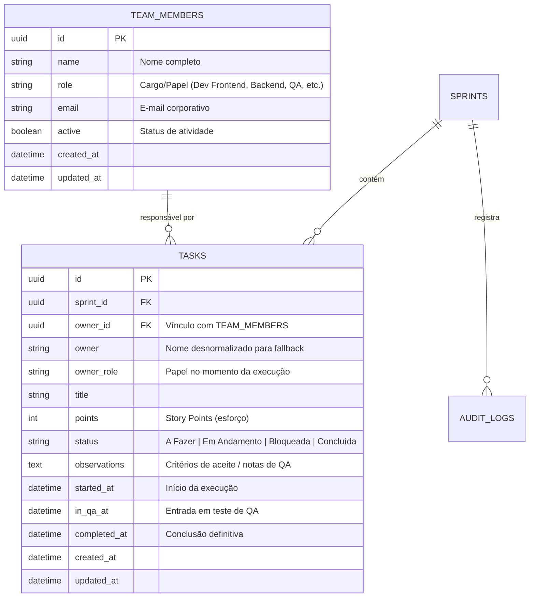
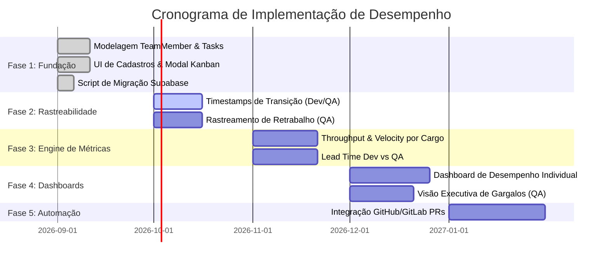

# 🗺️ Roadmap Técnico: Gestão de Equipe, Atribuição de Tasks e Métricas de Desempenho

> **Documento de Arquitetura de Software**  
> **Sistema**: PainelPro / Painel Gover Tech  
> **Autor**: Arquiteto de Software & Engenharia  
> **Status**: Fase 1 Implementada / Fases 2 a 5 Planejadas

---

## 🎯 1. Visão Geral e Objetivos de Negócio

Este roadmap estabelece a evolução arquitetural para transformar o Painel Gover Tech em uma plataforma de governança executiva orientada a dados, permitindo:
1. **Cadastro e Gestão de Equipe Técnica**: Desenvolvedores Frontend, Backend, Fullstack, QAs / Analistas de Testes, Tech Leads e DevOps.
2. **Atribuição Granular de Tasks**: Vínculo direto de tarefas a responsáveis com identificação de papel/cargo e estimativa em Story Points.
3. **Métricas de Produtividade e Eficiência**: Cálculo automatizado de throughput, lead time de desenvolvimento vs. homologação/QA, WIP (Work in Progress), e taxa de retrabalho.
4. **Paridade Arquitetural Local & Nuvem**: Compatibilidade total entre o modo `LocalStorage` e a persistência em `Supabase / PostgreSQL`.

---

## 🏗️ 2. Arquitetura de Domínio & Dados

### 2.1 Modelo Entidade-Relacionamento

---

## 📅 3. Fases do Roadmap Técnico

---

### 🟢 Fase 1: Fundação de Dados e Atribuição (Concluída ✅)
- [x] Criação do tipo `TeamRole` e interface `TeamMember` no domínio de cadastros.
- [x] Extensão de `SprintTask` com `ownerId` e `ownerRole`.
- [x] Repositório `LocalStorageRegistrationRepository` atualizado com dados padrão de equipe.
- [x] Tela de Cadastros (`/cadastros`) com aba **"Equipe (Devs / QAs)"** permitindo inclusão, edição e controle de status ativo.
- [x] Modal de detalhes da Sprint (`SprintDetailsModal`) com seleção inteligente de responsável (Nome + Cargo) e identificação visual por tags no quadro de tasks.
- [x] Script de migração oficial Supabase SQL (`supabase/migrations/20260902_team_members_and_task_attribution.sql`).

---

### 🟡 Fase 2: Transições de Estado e Handoff Dev ➔ QA
- [ ] **Timestamps Granulares na Task**:
  - `started_at`: Momento em que a task vai para *Em Andamento*.
  - `in_qa_at`: Momento em que o Dev conclui o código e envia para homologação interna de QA.
  - `qa_approved_at`: Momento em que o QA aprova a entrega.
  - `completed_at`: Conclusão total da tarefa.
- [ ] **Contador de Reaberturas / Retrabalho**:
  - Registro de quantas vezes uma task retornou de *QA* para *Em Andamento* (Dev Fix).

---

### 🟠 Fase 3: Motor de Métricas de Desempenho (Analytics Engine)

#### 3.1 Indicadores para Desenvolvedores
1. **Throughput Individual**: Quantidade de tasks e Story Points entregues por Sprint/Mês.
2. **Lead Time de Desenvolvimento ($LT_{dev}$)**:
   $$\text{Tempo Médio} = \text{in\_qa\_at} - \text{started\_at}$$
3. **Taxa de Estabilidade de Código ($Rework\%$)**:
   $$\text{Rework Rate} = \frac{\text{Tasks Rejeitadas pelo QA}}{\text{Total de Tasks Entregues}} \times 100$$

#### 3.2 Indicadores para QAs / Analistas de Testes
1. **QA Cycle Time ($CT_{qa}$)**:
   $$\text{Tempo de Homologação} = \text{completed\_at} - \text{in\_qa\_at}$$
2. **Defect Detection Efficiency (DDE)**: Percentual de inconsistências encontradas na fase de homologação interna antes do cliente/faturamento.
3. **Capacidade de Validação**: Volume de pontos validados por QA por Sprint.

#### 3.3 Indicadores Globais do Time
- **WIP Balance**: Identificação de sobrecarga (ex: muitos devs entregando e fila de QA represada).
- **Flow Efficiency**: Razão entre tempo ativo de trabalho e tempo de espera em fila.

---

### 🔵 Fase 4: Dashboards Executivos de Performance
- [ ] Nova página `/performance` ou aba dedicada no Dashboard Gover.
- [ ] Filtro por Cargo (*Todos*, *Desenvolvedor Backend*, *Desenvolvedor Frontend*, *QA*).
- [ ] Cards de KPIs individuais (Média de pontos, tempo médio de entrega, tarefas ativas).
- [ ] Gráficos comparativos de distribuição de esforço e eficiência de fluxo.

---

### 🟣 Fase 5: Integrações CI/CD & Automação
- [ ] Webhook com GitHub/GitLab: Mover task para *QA* automaticamente ao abrir Pull Request.
- [ ] Notificações via Slack/Teams quando uma task estiver pronta para validação de QA.

---

## 🛡️ 4. Diretrizes de Segurança & Privacidade (LGPD)

- As métricas de desempenho devem ser utilizadas exclusivamente para melhoria contínua de processos, dimensionamento de squads e identificação de gargalos de fluxo sistêmicos.
- Os dados sensíveis (e-mail, IDs de usuário) contam com proteção RLS (Row Level Security) nas tabelas do Supabase.
