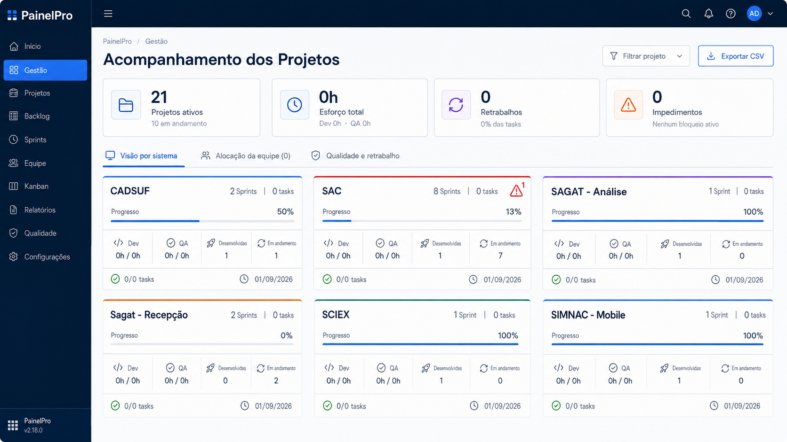

# Roadmap — Otimização do Acompanhamento dos Projetos

O mockup apresenta o estado normal e, no card SAC, um exemplo visual do alerta condicional de bloqueio. O contador é ilustrativo para demonstrar o componente e não representa alteração nos dados atuais.

## Visão de produto

A tela deve permitir que a liderança compare projetos em poucos segundos. A otimização preserva todos os indicadores e cálculos atuais, reduz textos repetitivos e reorganiza a informação por hierarquia, ícones e posição.

Não faz parte deste roadmap alterar regra de negócio, fonte de dados, cálculo, filtro ou exportação.

## Diagnóstico CPO

Hoje a tela entrega os dados necessários, mas exige leitura excessiva:

- os quatro KPIs ocupam muito espaço para poucas informações;
- os cards repetem títulos extensos dentro de quatro caixas coloridas;
- Dev, QA, Sprints desenvolvidas e Sprints em andamento aparecem como blocos independentes, embora sejam uma única faixa de comparação;
- a cor compete com os números, dificultando identificar rapidamente o que exige atenção;
- existem textos explicativos que repetem o significado do ícone ou do valor;
- a grade de duas colunas aumenta a rolagem e reduz a visão comparativa do portfólio.

## Direção visual

Direção: **Swiss operacional aplicada ao Design System do PainelPro**.

- superfícies brancas e fundo neutro;
- hierarquia por alinhamento, linhas de 1 px e escala tipográfica;
- números com maior peso visual;
- ícones Lucide para orientar a leitura;
- azul primário para navegação e ação;
- cores de projeto somente como identidade discreta;
- cores semânticas reservadas a sucesso, alerta, retrabalho e impedimento.

O elemento característico será a **faixa de telemetria do projeto**: quatro indicadores alinhados horizontalmente, cada um formado por ícone, rótulo curto e valor tabular.

## Indicadores preservados

### Visão geral

| Indicador atual | Apresentação proposta | Regra preservada |
| --- | --- | --- |
| Projetos monitorados | Ícone de projeto + total + “Projetos ativos” | Mesma quantidade de projetos filtrados. |
| Projetos com Sprints abertas | Informação secundária “N em andamento” | Mesmo cálculo de projetos com Sprint não faturada. |
| Esforço apontado | Ícone de relógio + total de horas | Mesma soma de Dev e QA. |
| Horas Dev e QA | Linha curta “Dev Nh · QA Nh” | Mesmos totais separados. |
| Taxa de retrabalho | Ícone de ciclo + percentual | Mesmo cálculo percentual. |
| Tasks com retrabalho | Informação secundária “N tasks” | Mesma quantidade. |
| Impedimentos | Ícone de alerta + total | Mesma quantidade de Sprints bloqueadas. |
| Estado dos impedimentos | Texto contextual de uma linha | Mesma condição de bloqueio. |

### Card de projeto

| Indicador atual | Apresentação proposta |
| --- | --- |
| Projeto/sistema | Nome no cabeçalho, com filete superior na cor cadastrada. |
| Total de Sprints e Tasks | Metadados compactos à direita do nome. |
| Progresso médio | Percentual destacado e barra fina usando a cor do projeto. |
| Horas Dev realizadas/estimadas | Ícone de código + “Dev” + valor. |
| Horas QA realizadas/estimadas | Ícone de checklist + “QA” + valor. |
| Sprints desenvolvidas | Ícone de camadas concluídas + quantidade. |
| Sprints em andamento | Ícone de atividade + quantidade. |
| Tasks concluídas/total | Rodapé com ícone de conclusão. |
| Última atualização | Rodapé com ícone de relógio e data. |
| Retrabalho do projeto | Badge semântico exibido somente quando maior que zero. |
| Bloqueios do projeto | Ícone `AlertTriangle` vermelho no cabeçalho, com contador e tooltip, exibido somente quando houver bloqueio. |

Nenhum indicador será removido. Textos completos ficam disponíveis por tooltip e descrição acessível quando o rótulo visual for abreviado.

## Arquitetura da informação proposta

### 1. Cabeçalho da página

- manter título e breadcrumb do App Shell;
- alinhar filtro de projeto e exportação à direita;
- usar “Projetos” como opção geral do filtro;
- manter a exportação CSV como ação secundária com ícone de download.

### 2. Faixa de KPIs

- quatro cards em uma linha no desktop;
- estrutura interna: ícone à esquerda, valor em destaque, rótulo curto e contexto em uma linha;
- remover chips decorativos como “Sob controle” quando a cor e o contexto já comunicarem a situação;
- altura uniforme e menor que a atual;
- tooltip para explicar fórmulas, sem ocupar a tela com instruções.

### 3. Navegação e filtros

- manter as três visões: Sistema, Equipe e Qualidade;
- usar ícones do Design System junto aos nomes;
- manter tabs e controles na mesma barra operacional;
- em telas pequenas, permitir rolagem horizontal das tabs e quebrar os controles para uma segunda linha.

### 4. Grade de projetos

- três colunas em monitores largos;
- duas colunas em notebook;
- uma coluna em tablet estreito e celular;
- preservar ordenação e filtros atuais;
- não limitar a quantidade de cards.

### 5. Estrutura do card

1. Cabeçalho: nome, total de Sprints e total de Tasks.
2. Progresso: rótulo curto, percentual e barra.
3. Telemetria: Dev, QA, Desenvolvidas e Em andamento.
4. Alertas: somente quando existir retrabalho ou impedimento. Havendo bloqueio, exibir `AlertTriangle` vermelho com a quantidade; o tooltip informa “N bloqueios ativos” e pode listar o contexto disponível.
5. Rodapé: Tasks concluídas e última atualização.

## Aplicação obrigatória do Design System

### Componentes

- `Paper` para KPIs e cards;
- `Typography` para rótulos e valores;
- `LinearProgress` para progresso;
- `Tabs` e `Tab` para as visões;
- `TextField select` para filtro;
- `Button outlined` para exportação;
- `Chip` apenas para estados excepcionais;
- `Tooltip` para descrições completas;
- ícones exclusivamente de `lucide-react`.

O alerta de bloqueio deve usar `AlertTriangle`, `error.main` e área clicável/focável mínima de 32 px. Quando o total for zero, o componente não é renderizado e não deixa espaço reservado.

### Tokens visuais

- fundo: `background.default`;
- superfície: `background.paper`;
- texto principal: `text.primary`;
- texto secundário: `text.secondary`;
- borda: `divider`;
- ação: `primary.main`;
- sucesso: `success.main`;
- retrabalho: `warning.main`;
- impedimento: `error.main`;
- QA: `secondary.main`;
- raio de cards: 8–10 px;
- sombra: nenhuma ou sombra mínima do Design System;
- títulos e números: Space Grotesk;
- conteúdo e controles: DM Sans.

As cores cadastradas dos projetos continuam sendo a fonte de identidade. Devem aparecer somente no filete superior e na barra de progresso, evitando fundos coloridos grandes.

## Regras de redução de texto

- “Projetos monitorados” passa visualmente para “Projetos ativos”; a definição completa vai para tooltip.
- “Esforço apontado” passa para “Esforço total”.
- “Qualidade & Retrabalho” no KPI passa para “Retrabalhos”.
- “Impedimentos em aberto” passa para “Impedimentos”.
- “Desenvolvimento” passa para “Dev”.
- “Qualidade & Teste (QA)” passa para “QA”.
- “Sprints desenvolvidas” passa para “Desenvolvidas” dentro do card.
- datas exibem somente o valor; o ícone e o tooltip informam “Última atualização”.

As versões completas continuam em `aria-label`, tooltip, relatório CSV e documentação.

## Responsividade

| Largura | KPIs | Cards | Telemetria |
| --- | --- | --- | --- |
| ≥ 1280 px | 4 colunas | 3 colunas | 4 itens na mesma linha |
| 900–1279 px | 2 colunas | 2 colunas | 4 itens na mesma linha |
| 600–899 px | 2 colunas | 1 coluna | 4 itens ou 2 × 2 |
| < 600 px | 1 coluna | 1 coluna | grade 2 × 2 |

Não deve haver truncamento de números, sobreposição de ícones ou rolagem horizontal da página.

## Fases sugeridas

### Fase 0 — Baseline e proteção

- registrar captura da tela atual em desktop e mobile;
- documentar todos os indicadores e fórmulas;
- criar testes que garantam os mesmos números antes e depois da mudança.

**Aceite:** matriz de indicadores aprovada, sem divergência de cálculo.

### Fase 1 — Primitivos do Design System

- criar componentes reutilizáveis `ProjectKpi`, `ProjectMetric` e `ProjectCardFooter` com MUI;
- centralizar espaçamento, tipografia, tooltip e tratamento de valores longos;
- remover cores e dimensões duplicadas do arquivo da página.

**Aceite:** componentes aparecem no Design System e não criam novos tokens paralelos.

### Fase 2 — KPIs compactos

- migrar os quatro KPIs para a composição ícone–valor–rótulo–contexto;
- preservar cálculo e interação;
- reduzir altura e conteúdo redundante.

**Aceite:** todos os valores atuais permanecem visíveis em uma dobra de notebook.

### Fase 3 — Cards de projeto

- substituir quatro caixas coloridas pela faixa de telemetria;
- aplicar filete e progresso com a cor cadastrada do projeto;
- manter alertas condicionais e rodapé operacional;
- adicionar no cabeçalho do card o alerta condicional de bloqueio com contador e tooltip;
- alterar a grade para três, duas ou uma coluna conforme viewport.

**Aceite:** todos os indicadores atuais do card continuam disponíveis e a comparação entre três projetos cabe lado a lado em desktop.

### Fase 4 — Abas, filtros e estados

- compactar barra de tabs e controles;
- revisar estados vazio, carregando, erro e filtro sem resultado;
- adicionar tooltip e acessibilidade aos rótulos abreviados.

**Aceite:** navegação por teclado e leitor de tela comunicam os nomes completos dos indicadores.

### Fase 5 — Validação CPO e QA

- validar a leitura com liderança, PO e gerente de projeto;
- testar desktop, notebook, tablet e celular;
- comparar exportação CSV antes/depois;
- executar typecheck, testes React e build.

**Aceite:** nenhum indicador, filtro, cálculo ou campo de exportação foi alterado; redução mensurável da altura média dos cards e da rolagem necessária.

## Métricas de sucesso

- localizar um projeto crítico em até 5 segundos;
- comparar progresso e execução de três projetos sem rolar a página em desktop;
- reduzir em pelo menos 25% a altura média do card;
- manter 100% dos indicadores e dados exportáveis;
- zero divergência entre valores da versão atual e da versão otimizada.

## Fora do escopo

- alterar fórmulas de progresso, esforço, retrabalho ou impedimentos;
- remover abas ou indicadores;
- mudar regras de acesso;
- modificar dados ou cadastros;
- implementar a proposta neste momento.
