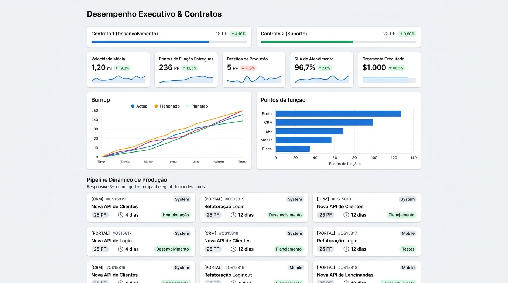
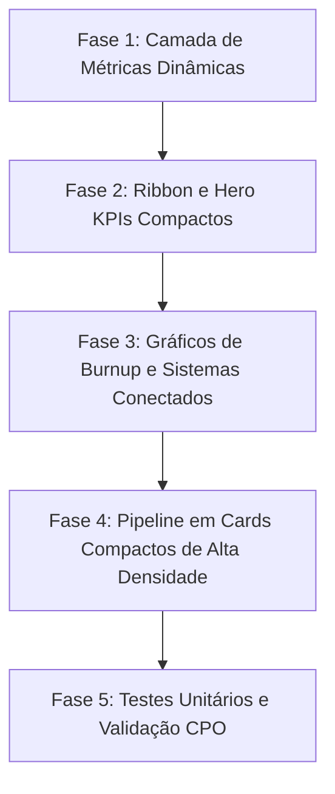

# Roadmap — Otimização do Desempenho Executivo & Contratos



O mockup apresenta a reorganização de alta densidade da página de **Desempenho Executivo & Contratos** (`/executive`). A proposta introduz disciplina visual suíça (*Swiss design*), elimina duplicações entre o cabeçalho e os cartões, conecta os gráficos diretamente aos dados reais das Sprints e **preserva o formato de cards interativos no Pipeline Dinâmico de Produção**, otimizando seu tamanho, hierarquia de dados e ocupação vertical.

---

## 1. Visão de Produto

A página de **Desempenho Executivo & Contratos** é a principal interface de prestação de contas estratégica para a Diretoria, Superintendência e Gestores de Contrato. Em uma única visualização de alta densidade, o dashboard deve responder com precisão em menos de 5 segundos às 3 perguntas cruciais da liderança:

1. **Saúde Financeira e Contratual:** Quanto do teto contratual de Pontos de Função (PF) já foi consumido e qual o saldo remanescente até o término da vigência?
2. **Ritmo de Execução (Burnup):** A fábrica de software está entregando na cadência necessária para cumprir a meta do ciclo sem estouro nem subutilização?
3. **Destinação dos Recursos & Pipeline Ativo:** Onde os Pontos de Função faturados foram investidos (distribuição por sistema) e quais são as demandas reais em andamento na esteira (visualizadas em cards ágeis de alta densidade)?

> [!IMPORTANT]
> **Escopo deste Roadmap:** Otimização de arquitetura de informação, hierarquia visual, redução de ruídos, substituição de dados estáticos mockados por dados dinâmicos reais do repositório, **otimização dimensional dos cards do Pipeline Dinâmico de Produção** e padronização com o Design System. **Não faz parte deste roadmap** alterar regras de negócio contratuais ou fórmulas contábeis de Pontos de Função.

---

## 2. Diagnóstico CPO & UX

A análise aprofundada da versão atual da página `/executive` revelou pontos de atrito cognitivo e oportunidades de melhoria:

### 🔴 Principais Dores Identificadas:

1. **Duplicação Severa de Informação Contratual:**
   - O *Top Ribbon* (barra superior) exibe: `"Contrato 1: 6.240 / 8.000 PF (Faltam 1.760 PF)"`.
   - Logo abaixo, o *Hero KPI 1* repete: `"CONTRATOS CONSOLIDADOS: 6.240 PF / Faltam 1.760 PF para atingir 8.000 PF"`.
   - O *Hero KPI 2* repete novamente: `"FATURAMENTO ACUMULADO: 6.240 PF / Faltam 1.760 PF"`.
   - O *Hero KPI 5* repete o Contrato 2: `"PROJETO SUSTENTAÇÃO: 2.450 PF / Saldo restante 550 PF"`.
   - *Diagnóstico:* Quatro blocos distintos competem entre si repetindo os mesmos números e percentuais.

2. **Gráficos Desconectados da Base Real (Mockados):**
   - O gráfico de **Burnup Acumulado** consome uma constante estática de meses (`MONTHLY_DATA`) com valores fixos em código, sem considerar as Sprints e faturamentos reais do repositório.
   - O gráfico de **Distribuição por Sistema** consome um array fixo (`SYSTEMS_METRICS`), em vez de agregar em tempo real o histórico de PF faturados por sistema nas Sprints concluídas.

3. **Pipeline em Cards Volumosos e com Emojis Informais:**
   - O pipeline ativo de demandas em cards é visualmente querido pela gestão porque permite bater o olho em cada OS individualmente. No entanto, hoje os cards são excessivamente altos (~155px), têm paddings inflados e utilizam emojis informais (`🚀 Entrega Iminente`, `🔨 Em Desenvolvimento`, `⚡ Em Homologação`).
   - *Diagnóstico:* O formato de **cards** deve ser **preservado**, mas com redução de altura para ~105px (-35% de espaço vertical), tipografia executiva calibrada, eliminação de emojis e dados melhor organizados.

4. **Falta de Indicadores Críticos de Runway:**
   - A liderança não visualiza a métrica de **Runway** (quantos meses de capacidade ainda restam com base no ritmo médio de consumo mensal) nem a **Velocidade Média (Run-rate)** em PF/mês.

5. **Excesso de Rolagem Vertical:**
   - A sobreposição de Top Ribbon + 5 Hero KPIs volumosos + 2 Gráficos + Pipeline de cards altos estende a página além do limite ideal de leitura executiva.

---

## 3. Direção Visual (CleanUI & Swiss Operacional)

A refatoração adotará a diretriz **Swiss Operacional de Alta Densidade**:

- **Superfícies Limpas e Contraste Sóbrio:** Fundo neutro `var(--bg, #f7f9fc)`, cards em superfícies brancas puras com bordas sutis de `1px solid #e2e8f0` e cantos arredondados de `8px`.
- **Cores Semânticas com Função Estrita:**
  - **Verde SUFRAMA Institucional (`#00843D` / `#16a34a`):** Metas financeiras atingidas, entregas homologadas e entregas no prazo.
  - **Azul Primário (`#2563eb`):** Contrato de Desenvolvimento & Melhorias, navegação e ações principais.
  - **Roxo Operacional (`#7c3aed`):** Contrato de Sustentação & Manutenção Contínua.
  - **Cinza Ardósia Neutro (`#64748b`):** Rótulos secundários, metadados e linhas de grade.
- **Tipografia Escalar:**
  - Números de destaque e títulos com **Space Grotesk** (pesos 600 e 700). Proibido pesos 800/900 em textos corridos.
  - Textos de apoio, tabelas e rótulos com **DM Sans** (pesos 400, 500 e 600).
- **Substituição de Emojis por Ícones Semânticos Lucide:** Eliminação de emojis informais, utilizando ícones consistentes (`FileText`, `Shield`, `TrendingUp`, `Clock`, `CheckCircle2`, `Layers`).

---

## 4. Indicadores Preservados e Refinados

| Indicador Atual | Apresentação Proposta | Justificativa / Regra Preservada |
|---|---|---|
| **Contrato 1: Desenvolvimento** | Barra integrada no Top Ribbon com progresso fino de 4px e valores tabulares | Mantém teto (`8.000 PF`), realizado (`6.240 PF`) e saldo (`1.760 PF`), liberando espaço nos Hero KPIs. |
| **Contrato 2: Sustentação** | Barra integrada no Top Ribbon com identificação roxa (`#7c3aed`) | Mantém teto (`3.000 PF`), realizado (`2.450 PF`) e saldo (`550 PF`). |
| **Vigência Contratual** | Chip sutil de vigência no Top Ribbon | Preserva período de Outubro a Setembro (2º Ano). |
| **Hero 1: Consolidado Global** | **Consumo Total Contratado** (Total PF / Teto Global + % atingido) | Mostra a soma dos contratos (`8.690 / 11.000 PF` · 79%) com barra de progresso única. |
| **Hero 2: Faturamento do Ciclo** | **Faturado no Ciclo Recente** (PF e quantidade de Sprints prontas para medição) | Evita repetir o acumulado global; destaca o valor faturado no último fechamento (+485 PF). |
| **Hero 3: Velocidade (Run-rate)** | **Média Móvel de Faturamento** (PF / Mês) | Novo cálculo executivo: média de consumo dos últimos 3 meses, indicando a cadência da fábrica. |
| **Hero 4: Runway / Cobertura** | **Previsão de Cobertura Contratual** (Meses restantes até esgotar o saldo) | Cruza o saldo restante (`2.310 PF`) com a velocidade média mensal, alertando se o contrato cobre até o fim da vigência. |
| **Hero 5: Pipeline Ativo (WIP)** | **Volume em Execução** (PF em Desenvolvimento + Homologação) | Totaliza os pontos das Sprints em andamento, indicando o faturamento previsto a curto prazo. |
| **Curva de Burnup** | Gráfico vetorial SVG alimentado pelo histórico real de faturamento | Linha azul contínua (Realizado), linha tracejada (Meta Linear Contratual) e projeção de encerramento. |
| **Distribuição por Sistema** | Barras horizontais dinâmicas calculadas via agregação das Sprints | Ordenação automática decrescente por PF entregues, com percentual do portfólio. |
| **Pipeline de Demandas** | **Cards Otimizados de Alta Densidade** (preserva o formato de cards ativo) | Redução de altura de 155px para 105px (-35%), hierarquia em 3 linhas compactas, sem emojis e com atalho direto para o modal. |

---

## 5. Arquitetura da Informação Proposta

A página será estruturada em 4 blocos perfeitamente harmonizados:

```
┌─────────────────────────────────────────────────────────────────────────────┐
│ 1. RIBBON CONTRATUAL COMPACTO (Vigência · Dev 78% · Sust 82% · Ação Gerenciar)│
├─────────────────────────────────────────────────────────────────────────────┤
│ 2. HERO KPIS ESTRATÉGICOS (5 colunas compactas)                             │
│   [ Consumo Global ] [ Faturado Ciclo ] [ Run-rate Mês ] [ Runway ] [ WIP ] │
├──────────────────────────────────────┬──────────────────────────────────────┤
│ 3. INTELIGÊNCIA GRÁFICA (1.15fr)     │ 4. DISTRIBUIÇÃO POR SISTEMA (1fr)    │
│   Curva de Burnup Real vs Meta       │   Barras Horizontais Dinâmicas (PF)  │
├──────────────────────────────────────┴──────────────────────────────────────┤
│ 5. PIPELINE DINÂMICO DE PRODUÇÃO EM CARDS COMPACTOS (3 colunas · ~105px)    │
│   [ Card OS 1 ]            [ Card OS 2 ]            [ Card OS 3 ]           │
│   [ Card OS 4 ]            [ Card OS 5 ]            [ Card OS 6 ]           │
└─────────────────────────────────────────────────────────────────────────────┘
```

### Detalhamento dos Componentes:

### 1. Ribbon Contratual de Alta Densidade (`ExecutiveContractRibbon.tsx`)
- Barra horizontal compacta com altura de ~40px.
- Exibe os dois contratos lado a lado com medidores lineares finos (4px) e rótulos compactos.
- Botão sutil *"Gerenciar Contratos"* com atalho para o módulo de cadastros.

### 2. Faixa de Hero KPIs Estratégicos (`ExecutiveHeroKpiGrid.tsx`)
- 5 cartões uniformes dispostos em grid de 5 colunas no desktop (`lg`), adaptável para 2 e 1 coluna em telas menores.
- **Estrutura interna de cada cartão:**
  - Topo: Rótulo curto em caixa alta (`0.6875rem`, `fontWeight: 700`, cor secundária) + badge sutil de situação.
  - Centro: Valor numérico em grande destaque (`1.4rem`, `Space Grotesk`, `fontWeight: 700`).
  - Rodapé: Contexto comparativo em uma única linha (ex: `+8.2% vs mês anterior` ou `Cobertura estimada até Nov/2026`).

### 3. Curva Dinâmica de Burnup Contratual (`ExecutiveBurnupChart.tsx`)
- Gráfico vetorial SVG proporcional e responsivo.
- Conecta-se às competências mensais reais do repositório (`LocalStorageRegistrationRepository` e Sprints com `billingForecastMonth`).
- Linha contínua azul para o faturamento realizado acumulado.
- Linha guia cinza pontilhada representando a meta linear teórica do contrato.
- Destaque no ponto atual com tooltip flutuante ao passar o mouse.

### 4. Distribuição de Faturamento por Sistema (`ExecutiveSystemsComparisonChart.tsx`)
- Cálculo em tempo real: agrupa todas as Sprints concluídas/faturadas por sistema e soma os Pontos de Função.
- Exibe barras horizontais com a cor institucional de cada sistema.
- Informa valor total acumulado e percentual de participação no portfólio.

### 5. Pipeline Dinâmico de Produção em Cards Compactos (`ExecutiveVisualPipeline.tsx`)
Mantém o formato de **cards visuais do layout ativo**, porém com refatoração cirúrgica de dimensões e densidade de informação:

- **Dimensões e Grade:**
  - Grid de **3 colunas** no desktop padrão (expansível para 4 em telas largas).
  - Altura do card reduzida de **155px para 105px** (ganho de **35% de espaço vertical**).
  - Espaçamento interno reduzido para `p: 1.2` (10px a 12px) e `gap: 1` (8px).
- **Estrutura Interna de Cada Card:**
  - **Linha 1 (Identificação & Sistema):** Tag preta compacta com a OS (`#OS15819`, `height: 18px`, `fontSize: 0.625rem`) + Chip do sistema na cor oficial + Pílula de Pontos (`74.75 PF`, `height: 18px`, em negrito).
  - **Linha 2 (Título da Demanda):** Título/objetivo em tipografia limpa (`fontSize: 0.8125rem`, `fontWeight: 600`, limite de 2 linhas com `text-overflow: ellipsis`), eliminando descrições desnecessárias.
  - **Linha 3 (Telemetria & Estágio):** Prazo restante (`<Clock size={11} /> 4 dias restantes`) à esquerda + Badge sóbrio de estágio à direita (*Homologação*, *Desenvolvimento*, *Medição Pronta*), **sem emojis informais**.
- **Interatividade:** O card possui microinteração de hover (`transform: translateY(-1px)`) e ao ser clicado abre o modal de detalhe da Sprint diretamente.

---

## 6. Aplicação Obrigatória do Design System

### Componentes Material UI:
- **Superfícies:** `<Paper elevation={0}>` com `border: '1px solid #e2e8f0'` e `borderRadius: 2`.
- **Tipografia:** `<Typography>` mapeando `variant="h2"` para KPIs (`fontSize: '1.4rem'`), `variant="caption"` para legendas (`fontSize: '0.6875rem'`).
- **Medidores:** `<LinearProgress>` customizado com espessura de `4px` a `6px` e cantos arredondados.
- **Tags e Badges:** `<Chip size="small">` com altura padronizada de `18px` a `20px` e `fontSize: '0.625rem'`.
- **Ações:** `<Button variant="outlined" size="small">`.

### Tokens Visuais e Cores:
- **Background geral:** `var(--bg, #f7f9fc)`
- **Superfície dos cards:** `#ffffff`
- **Superfície dos cards de pipeline:** `#f8fafc` com borda `#e2e8f0`
- **Bordas:** `#e2e8f0`
- **Texto principal:** `text.primary` (`#0f172a`)
- **Texto secundário:** `text.secondary` (`#64748b`)
- **Ação e Dev:** `primary.main` (`#2563eb`)
- **Sucesso e Medição:** `success.main` (`#16a34a`)
- **Sustentação:** `secondary.main` (`#7c3aed`)

---

## 7. Regras de Redução de Texto e Ruídos Visuais

1. **Eliminar Títulos Redundantes:**
   - De `"CONTRATOS CONSOLIDADOS (DEV E SUSTENTAÇÃO)"` para `"CONSUMO GLOBAL"`.
   - De `"FATURAMENTO ACUMULADO DO ANO VIGENTE"` para `"FATURADO NO CICLO"`.
   - De `"CAPACIDADE PLENA DE ENGENHARIA EM OPERAÇÃO CONTÍNUA"` para `"WIP EM PRODUÇÃO"`.
2. **Eliminar Emojis Infantis nos Cards de Pipeline:**
   - De `🚀 Entrega Iminente` para badge formal `Pronto para Medição` ou `Iminente`.
   - De `⚡ Em Homologação` para badge formal `Homologação`.
   - De `🔨 Em Desenvolvimento` para badge formal `Desenvolvimento`.
3. **Mover Fórmulas e Detalhes Contratuais para Tooltips:**
   - Explicar regras de cálculo através de `<Tooltip arrow>` em ícones discretos de informação, liberando a área nobre da tela.

---

## 8. Plano de Fases para Execução



### Fase 1: Camada de Métricas Dinâmicas (`ExecutiveMetricsService.ts`)
- Criar serviço utilitário para calcular:
  - Consumo real e saldo dos contratos cruzando com as Sprints faturadas.
  - Velocidade média (run-rate) dos últimos 3 meses em PF.
  - Meses estimados de runway até o esgotamento do teto.
  - Agregação dinâmica de PF por sistema.

### Fase 2: Ribbon Contratual e Hero KPIs Compactos
- Refatorar o topo de `ExecutivePerformancePage.tsx`.
- Implementar o novo grid de 5 Hero KPIs eliminando qualquer texto ou barra de progresso duplicada.

### Fase 3: Gráficos Dinâmicos (Burnup e Distribuição)
- Atualizar `ExecutiveBurnupChart.tsx` para plotar os dados calculados dinamicamente no serviço da Fase 1.
- Atualizar `ExecutiveSystemsComparisonChart.tsx` para somar e ordenar os sistemas com base nas Sprints reais.

### Fase 4: Pipeline Dinâmico em Cards Otimizados
- Refatorar `ExecutiveVisualPipeline.tsx`, **mantendo a exibição em cards**, mas reduzindo a altura dos cards para ~105px (-35%), eliminando emojis, padronizando chips e permitindo abertura direta do modal da Sprint ao clicar.

### Fase 5: Testes Unitários e Validação CPO
- Atualizar `ExecutivePerformancePage.test.tsx` garantindo cobertura dos novos cálculos dinâmicos, renderização dos 5 Hero KPIs, dos cards do pipeline e ausência de regressões no Vitest.

---

## 9. Critérios de Aceitação

- [ ] **Preservação dos Cards no Pipeline:** O Pipeline Dinâmico de Produção continua exibindo cards visuais em grade de 3 colunas, conforme o layout ativo.
- [ ] **Otimização Dimensional dos Cards:** Altura dos cards do pipeline reduzida em aproximadamente 35% (~105px), sem perda de dados essenciais (OS, Sistema, PF, Prazo, Status).
- [ ] **Zero Duplicação de Dados:** Nenhum número ou texto contratual aparece repetido desnecessariamente entre o Ribbon e os Hero KPIs.
- [ ] **Dados 100% Dinâmicos:** Os gráficos de Burnup e Distribuição por Sistema refletem as Sprints e faturamentos reais do repositório, sem constantes mockadas estáticas.
- [ ] **Padrão CleanUI Estrito:** Ausência de emojis decorativos nos cards e obediência à escala tipográfica do Design System (`Space Grotesk` e `DM Sans`).
- [ ] **Qualidade Técnica:** `npm run typecheck` com 0 erros e 100% de aprovação na suíte de testes do Vitest (`npm run test:react`).
